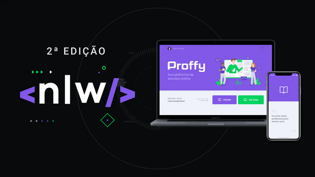

# :rocket: Next Level Week  - Proffy 

div align="center">
  

### Projeto

Aplicação que conecta estudantes e professores. Semana NLW - @rocketseat

- [FrontEnd](https://proffyy.vercel.app)
- [Video Demonstrando](https://www.youtube.com/watch?v=b_Ukizza2Hs&feature=youtu.be)

### Como rodar o projeto?
Após baixar o projeto, acesse ele do seu terminal rode os comandos:

* npm install
* npm start

### Tecnologias usadas :computer:
- Typescript
- React Native
